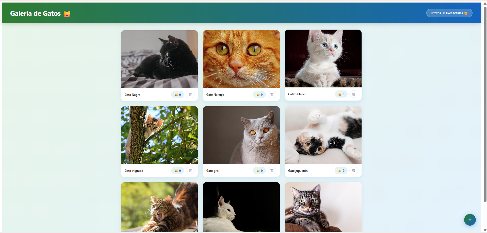
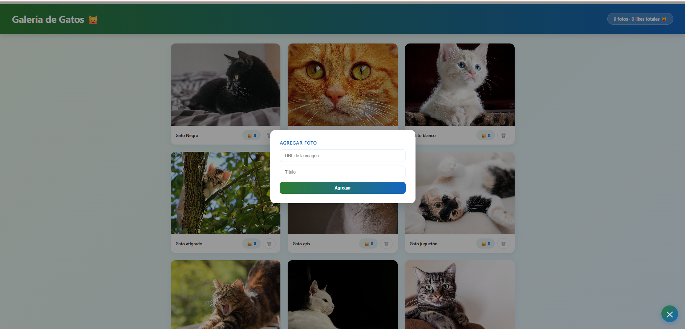
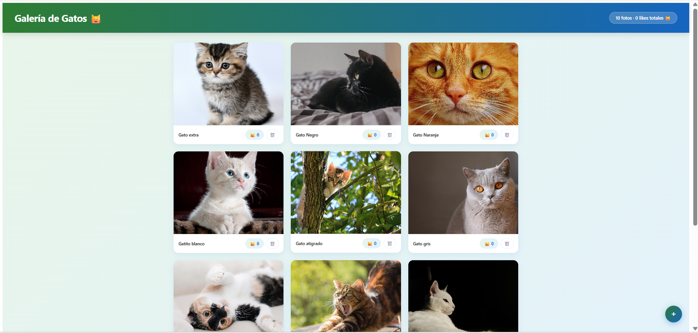
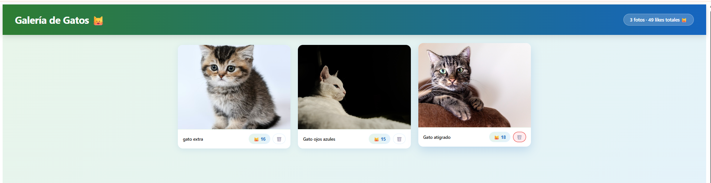
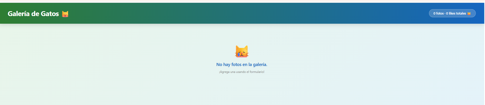
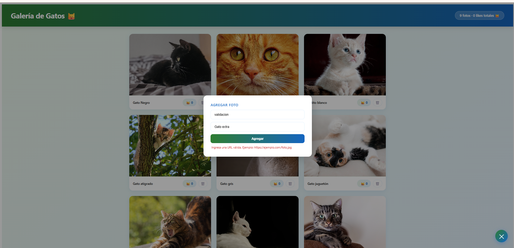

# Galería de Gatos 🐱

Galería de fotos interactiva — Angular + TypeScript
https://galeria-fotos-kd1q.onrender.com/

## Vista previa

## Descripción

SPA construida con Angular que permite gestionar una galería de fotos de gatos. Los datos persisten durante la sesión del navegador.

## Características

- Visualización de fotos en formato grid
- Agregar fotos con título y URL mediante formulario flotante
- Dar like a fotos individualmente con contador por foto
- Eliminar fotos con confirmación
- Contador global de fotos y likes totales
- Validación de formulario (URL y título obligatorios)
- Mensaje cuando la galería está vacía

